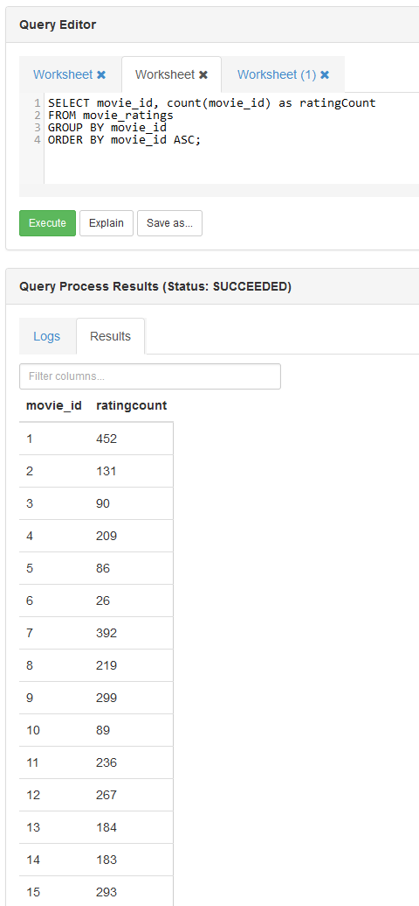
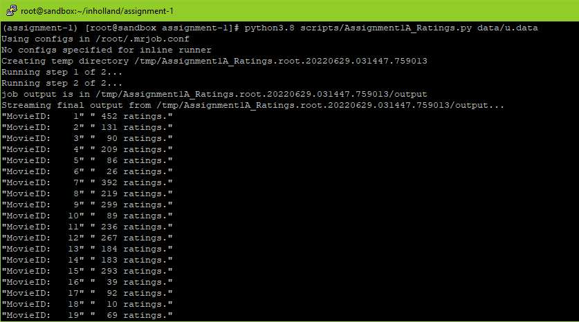

# **Assignment-1A Ratings**

## <a name="1."></a>**1. Student details**

|        |                                                                                          |
|:-------|:-----------------------------------------------------------------------------------------|
|Naam:   |Jasper Stedema                                                                            |
|Nummer: |621642                                                                                    |
|Github: |<https://github.com/Jasper-Dev/Inholland-P4.4-Parallel-Distributed-Processing-Assignments>|

## <a name="2."></a>**2. Execution**

> :warning: **Warning:** In order to run the code in this assignment, first make sure your hadoop sandbox is properly set up!

The configuration and setup steps can be found in the The steps can be found in [main README.md file](<../Assignment-1#2-prerequisites>)

### <a name="2.1."></a>**2.1. Download the required dataset**

```bash
#download the movielens dataset from inholland, and place the dataset in the 
#‘data’ folder inside the assignment’s vitual environment
wget http://witan.nl/hadoop/u.data --no-check-certificate
```

### <a name="2.2."></a>**2.2. Run the Python script**

```bash
#place the script inside the ‘scripts’ folder (I did this with WinSCP, but you are free to do it your own way) and run the python script
python3.8 scripts/Assignment1A_Ratings.py data/u.data

# to output the results to a timestamped file, append the command with the following line:
[..command..] > `date +%Y.%m.%d-%H.%M.%S`-MRJob-output-Assigment-A.txt

#example:
python3.8 scripts/Assignment1A_Ratings.py data/u.data > output/`date +%Y.%m.%d-%H.%M.%S`-MRJob-output-Assigment-A.txt
```

## <a name="3."></a>**3. Code & Explanation**

In this chapter, you can find the SQL query and the Python code used to answer assignment-1A aswell as the explanation for the Python code in the form of commands.

The results and screenshots of those results can be found in chapter [4. Results & Screenshots](#4.)

### <a name="3.1."></a>**3.1. Hive query**

In order to have an essence on how our data is going to look like,
it is key to first write the query in Hive. This will run faster and troubleshooting is easier,
as there is more documentation available on Hive.

```sql
SELECT movie_id, count(movie_id) as ratingCount
FROM movie_ratings
GROUP BY movie_id
ORDER BY movie_id ASC;
```

### <a name="3.2."></a>**3.2. MRJobs & MRSteps**

Now we know how our data needs to look like, we can begin writing our Python code for the Assignment1A.

```python
from mrjob.job import MRJob
from mrjob.step import MRStep

class Assignment1A_Ratings(MRJob):
```

```python
  # initiate mrjobs steps
  def steps(self):
    # instead of writing a script for each iteration, we can make use of steps.
    # with steps we specify all the steps mrjob needs to take and chain them together
    return [
      MRStep(
        mapper=self.mapper_get_movies,          # step 1.1, map the data
        combiner=self.combiner_count_ratings,   # step 1.2, combine/ mini-reduce the data
        reducer=self.reducer_count_ratings      # step 1.3, reduce the data
      ),
      MRStep( 
        reducer=self.reducer_output_ratings     # step 2.1, reduce to show the workings of multi-step jobs
      ) 
    ]
```

```python
  # mapping the data from the file to a table-like usable format
  def mapper_get_movies(self, _, line):
    # split the lines from the file into columns at the 'tab' character and assign a header to the columns 
    (userID, movieID, rating, timestamp) = line.split('\t')
    # yield the movieID's and assign each ID with a value of 1. 
    # This number will function like a "weight" which we can later use to count and evaluate the movieID's,
    # in this specific case, the "weight" is depending on the amount of ratings per row, which is 1.
    yield movieID, 1
```

```python
  # combiner is a mini-reducer that runs on the mapper-node before the data is being send over the network,
  # this will prevent the large amounts of data causing heavy traffic load or congestion (more effecive in larger datasets)
  # it takes the yielded movieID and assigned_value from the mapper and sums the assigned_values up for each reccuring movieID
  # which creates a list of key-value-pairs and passes it on to the reducer
  def combiner_count_ratings(self, movieID, assigned_value):
    yield movieID, sum(assigned_value)
```

```python
  # this will do basically the same as the combiner but on a different level
  # but unlike a combiner (which runs directly after the mapper on the same node before the data is being send over the network),
  # a reducer retrieves data from all the mapper nodes and performs the same actions as the combiner, so sum up all the assigned_values for the reccuring movieIDs within the list.
  # which creates a list of key-value-pairs and passes it on to the next step
  def reducer_count_ratings(self, movieID, occurrence):
    # this yielding line looks a bit different from the one in the combiner, as we need to send the key-value-pair list to the next step, rather than to the next part of a step.
    yield None, (movieID, sum(occurrence))
```

```python
  # reduce and output the data
  # mrjob can only have one reducer per step, thats why we are using mrstep to create multi-step jobs
  def reducer_output_ratings(self, _, input_generator):
    # convert generator to list
    inputlist = list(input_generator)
    # sort the list so the movieIDs are sorted in ASC order, this only works when the ID is cast to int, otherwise you're in for a whole bunch of shenanigans 😅
    sortedinputlist = sorted(inputlist, key=lambda row: int(row[0]))
      
    # loop through all the sorted list items
    for movieID, ratingcount in sortedinputlist:
    # print the list of movieIDs with their rating count.
    # the ".rjust(4,' ')" is to space the numbers evenly, so its easier to read.
    yield 'MovieID: ' + str(movieID).rjust(4, ' '), str(ratingcount).rjust(4, ' ') + ' ratings.'
```

```python
if __name__ == '__main__':
    Assignment1A_Ratings.run()
```

## <a name="4."></a>**4. Results & Screenshots**

- assignment A (Assignment1A_Ratings.py) is the base assignment for a grade 6/10

### <a name="4.1."></a>**4.1 Results**

```Text
"MovieID:    1" " 452 ratings."
"MovieID:    2" " 131 ratings."
"MovieID:    3" "  90 ratings."
"MovieID:    4" " 209 ratings."
"MovieID:    5" "  86 ratings."
"MovieID:    6" "  26 ratings."
"MovieID:    7" " 392 ratings."
"MovieID:    8" " 219 ratings."
"MovieID:    9" " 299 ratings."
"MovieID:   10" "  89 ratings."
"MovieID:   11" " 236 ratings."
"MovieID:   12" " 267 ratings."
"MovieID:   13" " 184 ratings."
"MovieID:   14" " 183 ratings."
"MovieID:   15" " 293 ratings."
"MovieID:   16" "  39 ratings."
"MovieID:   17" "  92 ratings."
"MovieID:   18" "  10 ratings."
"MovieID:   19" "  69 ratings."
```

### <a name="4.2."></a>**4.2 Screenshots**

_Assignment1A Hive SQL_



_Assignment1A MRJob CLI_


